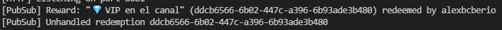
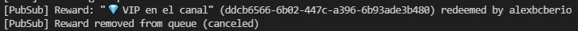

# Twitch Channel Redemptions

This tool let's you manage Twitch [channel point redemptions](https://help.twitch.tv/s/article/channel-points-guide)
and create unique experiences. When a viewer redeems a channel reward the tool
checks it and makes something. The limit is the sky! _and the programming skills
you have_

The tool is freely available for anyone, keep in mind that you will have to
adapt it to your needs as its set it up for my [Twitch channel](https://twitch.tv/alexbcberio).
Don't worry, I will try to guide you the best I can so you can adapt it for yourself.

These are some of the things you can already do with the tool:

- Timeout user: it times out a user for a minute (configurable).
- Get VIP role: assigns VIP to a user up to a limit, once the limit of users is
  reached it removes the VIP of the first one who got it and assigns it to the new
  user.
- Steal VIP from a user: it steals the VIP from anyone who got it **using channel
  points** and assigns it to this user. It cannot be used to take the VIP of a user
  who obtained it using other methods.

Feel free to contact me if you need any help via [Twitter](https://twitter.com/alexbcberio)
or [Discord](https://discord.com/users/202915432175239169).


## Important

### Channel points acceptable use policy

Remember to follow Twitch's [Channel Points Acceptable Use Policy](https://www.twitch.tv/p/en/legal/channel-points-acceptable-use-policy/)
whenever you use this tool. We will not take any responsibility for its bad use.

### Report bugs

Bugs? We do not want them, please [open a issue](https://github.com/alexbcberio/twitch-channel-redemptions/issues/new?labels=bug&template=bug_report.md).

### Request new features

Would you like me to implement something? Feel free to tell me everything [here](https://github.com/alexbcberio/twitch-channel-redemptions/issues/new?labels=enhancement&template=feature_request.md),
I will considerate it and implement it if it is interesting and not available
anywhere else.

## Installation

Follow this steps to set up the tool for your streams.

### Create a Twitch application

First [create a application](https://dev.twitch.tv/console/apps/create) through
Twitch developer console. For the OAuth Redirect URL set up the following
`http://localhost`. Take the client id and client secret and store
them in a file called `.env`. You have a template of this file available as `.env.example`.

The file content of the file should be something similar to this:

```env
TWITCH_CLIENT_ID=theClientIdProvidedByTwitch
TWITCH_CLIENT_SECRET=aSecretYouHaveToKeepSafe
TWITCH_CHANNEL_NAME=<username of the Twitch streamer>
```

### Create OAuth2 user token

Authenticate the account of the streamer using OAuth. Make a `GET` request to the
following url. You can paste it directly on the browser, be sure that everything
is in one line and that there are no white spaces between the lines.

```txt
GET https://id.twitch.tv/oauth2/authorize
  ?client_id=<your client ID>
  &redirect_uri=<your registered redirect URI>
  &response_type=code
  &scope=<space-separated list of scopes>
```

The scopes are the permissions you will be granting to the app. You can get all
the available scopes from [here](https://dev.twitch.tv/docs/authentication/#scopes),
some required scopes are: `channel:manage:redemptions`, `channel:moderate`,
`chat:edit` and `chat:read`.
Don't forget to set the exact same redirect_url as you did on the [application](#create-a-twitch-application).

Once authorized, you will get redirected to the specified address. The url will
have a `GET` parameter called `code` used to obtain the access token.

```txt
GET http://localhost/?code=<code of the authorization>
  &scope=<list of the authorized scopes>
```

Finally make a `POST` request to the following url, you can use a REST online tool
as [hoppscotch](https://hoppscotch.io/) or a desktop one such as [Insomnia](https://insomnia.rest/download).

```txt
POST https://id.twitch.tv/oauth2/token
  ?client_id=<your client ID>
  &client_secret=<your client secret>
  &code=<authorization code received above>
  &grant_type=authorization_code
  &redirect_uri=<your registered redirect URI>
```

You will get a JSON-encoded response, first transform the keys from kebab_case
to camelCase, there are free online tools as [this one](https://caseconverter.pro/use-cases/convert-json-keys-to-camel-case-online)
its better if you make it manually (you only have to remove the underscore and
set the following character to capital). Finally copy it into a file called
`tokens.json` and place it on the root of this project (same place as this file).

The JSON file must have this format, the values of the keys could vary:

```json
{
  "accessToken": "<the access token>",
  "expiresIn": 0,
  "refreshToken": "<the refresh token>",
  "scope": [
    "channel:manage:redemptions",
    "channel:moderate",
    "chat:edit",
    "chat:read"
  ],
  "tokenType": "bearer"
}
```

### Configure the channel point rewards

Once finished the [installation process](#installation) you have to set up the
channel point rewards on the tool. The tool can handle the redemptions automatically,
to do so the redemptions have to be created with the application itself. This restriction
is imposed by Twitch ([see it in their docs](https://dev.twitch.tv/docs/api/reference#update-redemption-status)).

#### Create a channel point reward

There's a small utility chatbot do help performing some tasks such as this one,
write this command in the chat to create a channel point reward.

```txt
!createReward <title> <cost>
```

#### Link channel point reward with an action

We call actions to the different integrations that can be set up with channel point
rewards. The available actions are stored in [`src/backend/pobSubClient/actions`](./src/backend/pubSubClient/actions)

The actions are mapped to a reward in [`src/enums/Redemptions.ts`](./src/enums/Redemptions.ts),
set the ID of the reward as the value.

To get the ID of a reward start the service start the tool in [development mode](#development)
and send the redeem the redemption you want to set up. It will show a message on
the console like this one. The ID is shown up twice, in this case `ddcb6566-6b02-447c-a396-6b93ade3b480`.



Once the ID is correctly set up (remember to save the file) redeem again the reward
it now should not show up a message telling that the redemption was not handled.



Repeat this same step for all any channel point reward you want to set up.

## Start the service

Install the dependencies executing the following command `yarn`, then you can
start the service using the start script `yarn start`. Keep the terminal open
until you want to close the service.

## Development

In order to start the service in development mode use the dev script `yarn dev`,
this will reload the backend whenever you make any change. Keep in mind that some
of the features might be disabled in this environment.

### Add new rewards

- TODO: document how to add new rewards

### Create own rewards

- TODO: document how to create new rewards.
